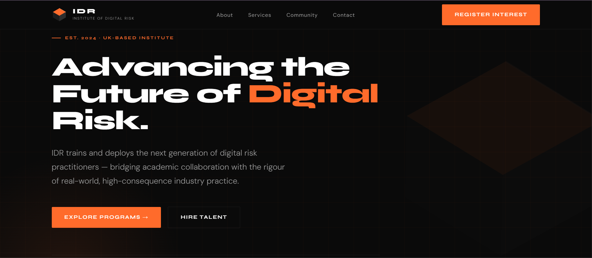

# Institute of Digital Risk (IDR) – Homepage & Brand Design

This project is a UI/UX and frontend implementation of a simple brand identity and responsive homepage for the **Institute of Digital Risk (IDR)**. The goal is to present IDR as an industry-led institute that trains and deploys professionals in digital, cyber, and AI risk management.

The project focuses on minimal design, clear information hierarchy, and responsive layout using only **vanilla HTML, CSS, and JavaScript**.

---

## Project Overview

The website introduces the Institute of Digital Risk and communicates its mission of developing professionals who can manage technology risks in modern organizations.

The homepage highlights:

- The mission of IDR
- The training and deployment model
- The services and programs offered
- The community served by the institute
- A call-to-action for engagement

The design follows a **modern technology and education aesthetic** using a color palette of **orange, black, and white**.

---

## Features

### 1. Brand Logo
Two logo variants are included:

- **Icon Only** – Cube-inspired geometric icon symbolizing structure, resilience, and risk management.
- **Icon + Text** – Full brand identity displaying *Institute of Digital Risk*.

The cube shape reflects **structured thinking and multi-dimensional risk analysis**, which are central to digital risk management.

---

### 2. Responsive Homepage

The homepage is designed to work on **desktop and mobile devices**.

Sections included:

#### Hero Section
- Headline introducing IDR’s mission
- Short description of the institute
- Call-to-action button

#### About IDR
Explains how the institute combines **academic collaboration with real-world industry practice** to train professionals in digital and cyber risk.

#### Service Pillars
Three core areas are presented:

- **Academy**  
  Training programs and bootcamps for students and professionals.

- **Innovation & Incubation**  
  Research and development in digital risk, AI governance, and new risk models.

- **Advisory Services**  
  Helping organizations implement frameworks such as **NIST**, **ISO 27001**, and **NIS2**.

#### Community
Describes the audience served by IDR:
- Students
- Early-career professionals
- Industry practitioners
- Organizations seeking cyber risk expertise

#### Contact Section
Simple contact form for inquiries and registrations.

---

## Technical Implementation

The website is built using **pure frontend technologies**.

**Technologies Used**

- HTML5 (Semantic Structure)
- CSS3 (Flexbox & responsive layout)
- JavaScript (Smooth scrolling interaction)

---

## Key Technical Features

- Semantic HTML structure (`header`, `nav`, `main`, `section`, `footer`)
- Sticky navigation bar
- Smooth scrolling between sections
- Responsive layout for mobile and desktop
- Accessible color contrast
- Hover states for buttons and navigation
- Clean and minimal UI

---

## Folder Structure
